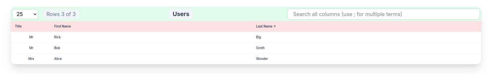

# BuildTable - React Data Table Component

A lightweight, production-ready **React data table** with sorting, pagination, global search, and full customization. Fetches JSON data via API proxy. Perfect for dashboards, admin panels, and data-heavy UIs.

## ✨ Features

- 🔍 **Global Search**: Multi-term (`;`) across all columns
- 📊 **Sorting**: Click headers (asc/desc)
- 📱 **Pagination**: Rows-per-page (10/25/50/All), prev/next
- 🎨 **Customizable**: Titles, colors, widths, alignment via props
- ⚡ **Fast**: Vite HMR, Tailwind CSS
- 🚀 **States**: Loading spinner, error handling, empty results
- 📱 **Responsive**: Mobile-optimized compact table

## 📱 Screenshots

## 🚀 Quick Start

